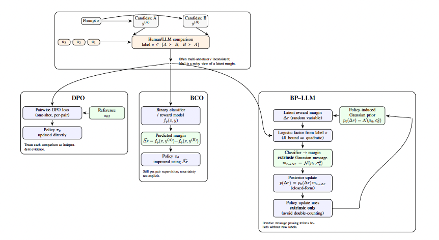

# BP-LLM: Belief Propagation for Binary Feedback in LLM Alignment
This repository provides the implementation of **BP-LLM**, a probabilistic framework for preference-based alignment using belief propagation under noisy binary feedback.

## 🔍 Overview
Preference-based alignment methods such as DPO and BCO treat comparisons as independent labels and do not explicitly model uncertainty.  
**BP-LLM** addresses this by:
- Modeling binary feedback as noisy observations of latent reward margins  
- Using a Gaussian prior induced by the policy  
- Performing belief propagation with closed-form Gaussian updates  
- Exchanging extrinsic messages between classifier and policy  
BP-LLM generalizes and recovers **DPO** and **BCO** as special cases.
 

## 🧪 Repository and Environment
This repository is organized around Google Colab notebooks. Each notebook is designed to run independently and reproduce a specific experimental setting reported in the paper.
All notebooks were developed and tested in Google Colab with an NVIDIA A100-SXM4-80GB GPU. The main software environment used for the experiments is:
- Python: `3.12.12`
- PyTorch: `2.10.0+cu128`
- Transformers: `5.0.0`
- PEFT: `0.18.1`
- Accelerate: `1.13.0`
- CUDA: available
- GPU: `NVIDIA A100-SXM4-80GB`
Because Google Colab environments may change over time, minor package adjustments may be needed to reproduce the notebooks.

## Citing BP-LLM
@article{liang2026bpllm,
  author    = {Liang, Jessica},
  title     = {{BP-LLM: Belief Propagation for Binary Feedback in Large Language Model Alignment}},
  journal   = {Transactions of the Association for Computational Linguistics},
  year      = {2026},
  note      = {Accepted for publication}
}

